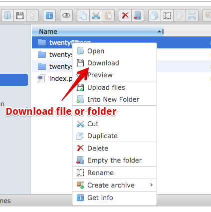
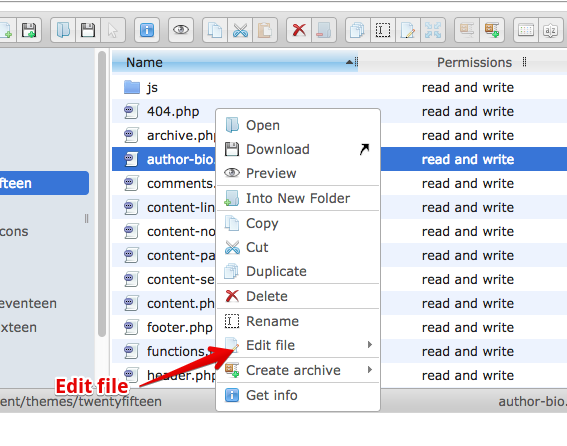
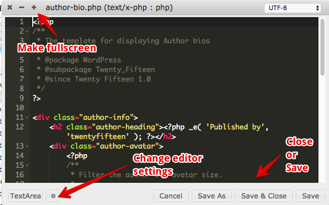

# InstantWP Web File Manager Documentation

    
## What is the Web File Manager?

This is a file manager for your WordPress installation, similar to Windows Explorer or macOS Finder. 

You can use it to copy, paste, upload and edit files in your InstantWP WordPress install.

## How do I upload files?

Simply click on the upload files button on the menu bar. 

You can then choose the files and folders you wish to upload:

## How do I download files?

Simply right click on the file or folder you wish to download. 

You can then choose the download link on the menu:

## How do I edit a file?

Simply right click on the file you wish to edit. 

You can then choose the edit link on the menu and choose the Ace Editor:

The Ace Editor will then open. 

 * You can make the editor fullscreen using the '+' button on the top left.
 * You can save or close the file using the buttons on the bottom right.
 * You can change the Ace Editor settings, including the theme, by using the gear icon.

## Tooltips and menus

There are multiple other buttons and menu choices available. 

* To see what  button does, hover your mouse pointer over the button and a tooltip will be displayed.
* Right click on folders and files to see what other functionality is available.

## Can I not use Windows Explorer or macOS Finder instead?

Of course! 
But there is a small bit of extra work to do.

See the InstantWP wiki links below for more details:

* [How to map a drive using SFTP in Windows Explorer](https://github.com/corvideon/InstantWP/wiki/Map-a-drive-using-SFTP-on-Windows)
* [How to mount WebDav in macOS Finder](https://github.com/corvideon/InstantWP/wiki/WebDav-Server-on-macOS)

## This is cool! Where can I get the code?

The InstantWP File Manager is a modified form of the excellent elFinder project available at [https://studio-42.github.io/elFinder/ ](https://studio-42.github.io/elFinder/)

&copy; Corvideon 2017